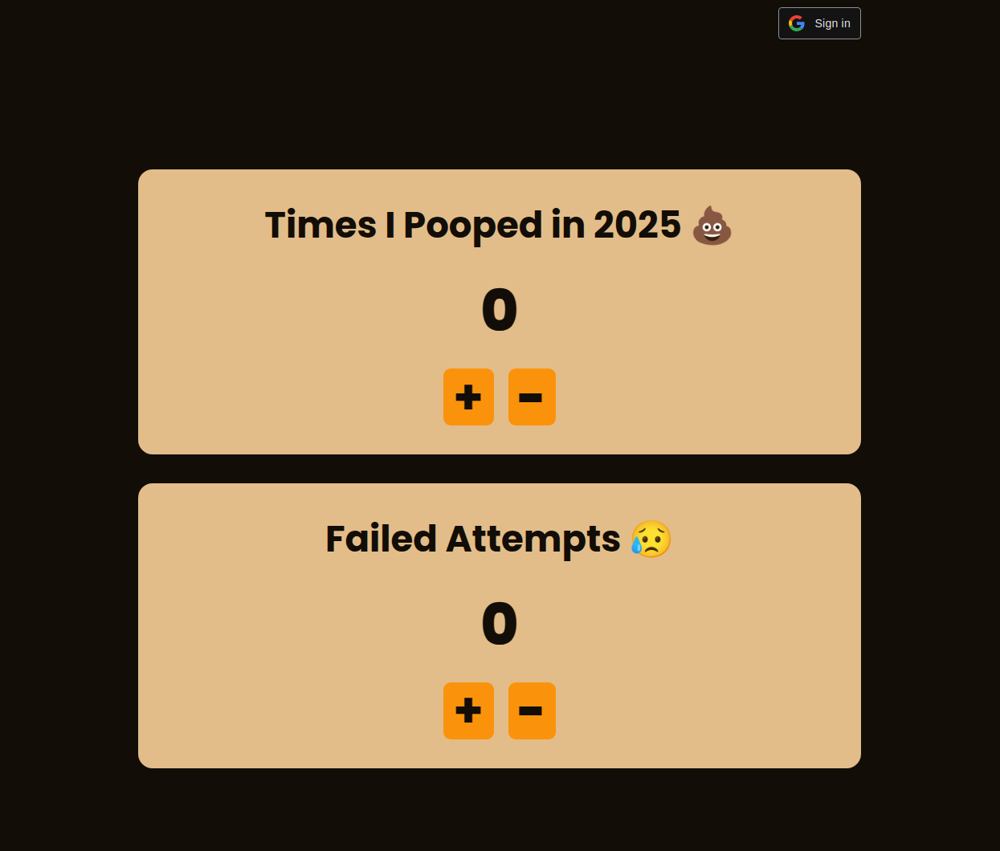

# timesipooped

my girlfriend wanted to count how many times she'll poop in 2025. this website
does exactly just that.

> [!NOTE]
> the website uses localstorage if not logged in

the website is made using a go server and vanilla javascript frontend

> [!WARNING]
> the website's CRSF protection can still be improved but i am currently busy right now

